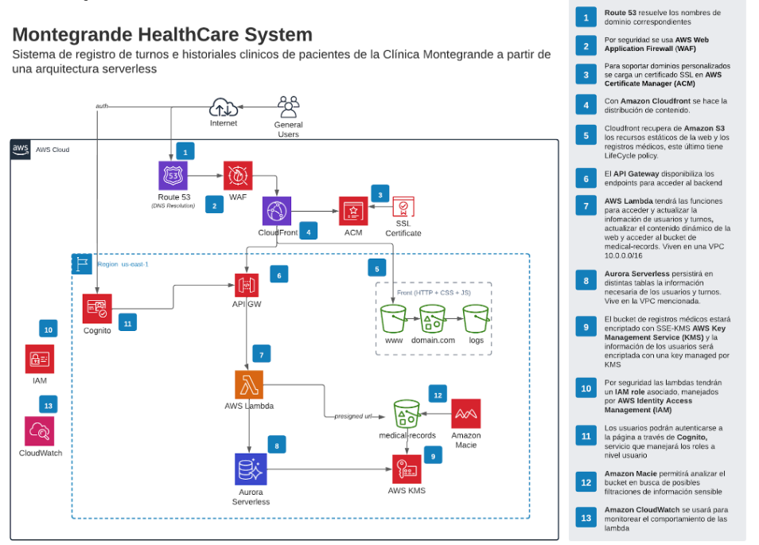
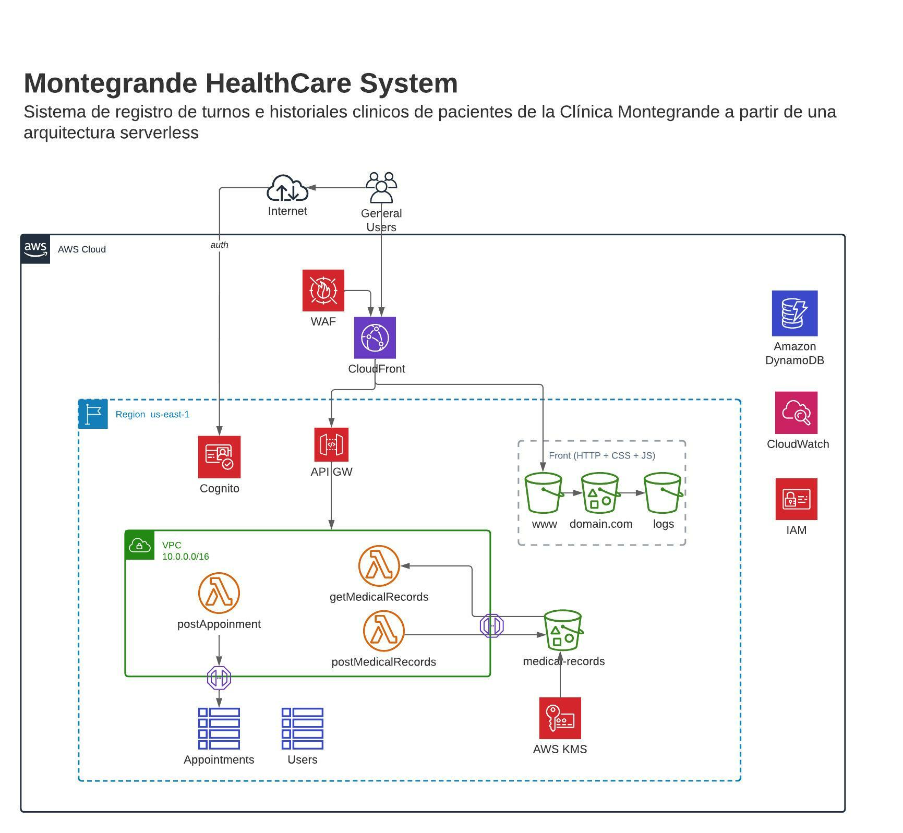

# Cloud Computing - AWS 

## Montegrande HealthCare System 

Serverless Terraform infrastructure for a HealthCare System.

**URL: https://montegrande-health-system.bytedev.com.ar/**
(importante: no cambiar el nombre del bucket del front porque se usa un dominio propio)

### 0. Integrantes 

- [Comerci, Nicolás](https://github.com/ncomerci)
- [Fernandez, Ariadna](https://github.com/arfernandez2000)
- [Lin, Scott](https://github.com/scottlin19)
- [Piñeiro, Eugenia Sol](https://github.com/eugepineiro)

### 1. Servicios implementados 
- API Gateway 
- Cloudfront 
- CloudWatch
- Cognito
- DynamoDB
- AWS Lambda 
- S3 buckets
- Web Application Firewall (WAF)

### 2. Instalación 

```bash 
terraform init 
terraform validate
terraform plan 
terraforom apply 
```

### 3. Arquitectura 
Arquitectura propuesta


Arquitectura deployada con las restricciones de Academy
